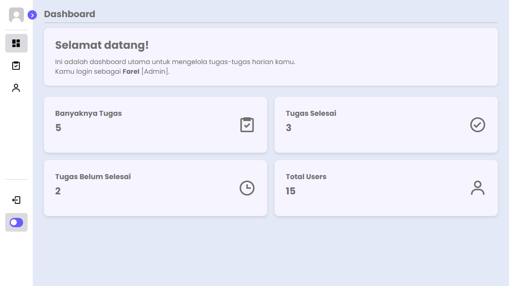
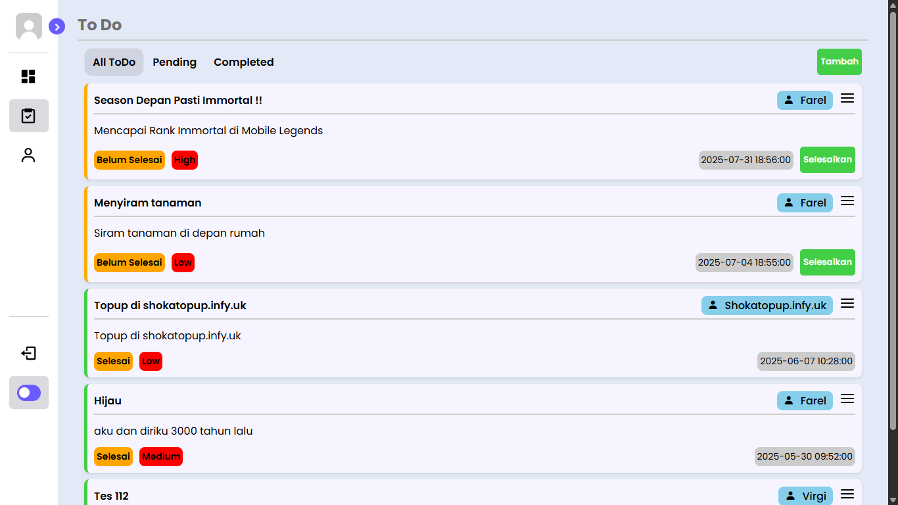
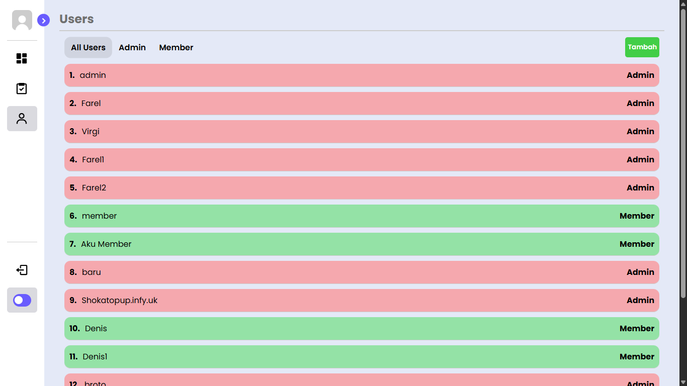
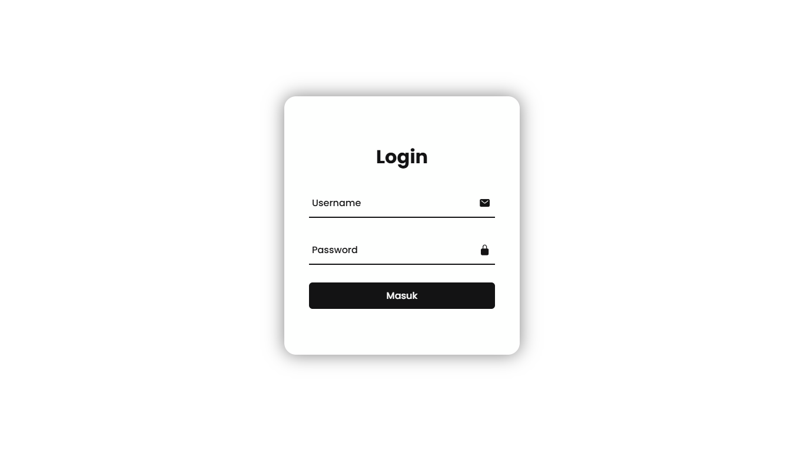

# TaskEase - Web To-Do List with Multi-User System

Web to-do list yang dirancang untuk membantu pengguna mengatur, memantau, dan menyelesaikan tugas harian dengan lebih terstruktur. Aplikasi ini mendukung banyak pengguna dengan peran berbeda (Admin & Member), serta memiliki tampilan dashboard modern yang responsif.

---

## 📌 Fitur Utama

- ✅ **Login Sistem** (username & password)
- 👥 **Manajemen User** (Admin dan Member)
- 📝 **Tambah/Edit/Hapus Tugas**
- 🏷️ **Prioritas Tugas** (Low, Medium, High)
- 📆 **Deadline Tugas**
- 🔄 **Filter Tugas** (Selesai, Belum Selesai, Semua)
- 📊 **Dashboard Statistik** (jumlah tugas, user, status selesai)
- 🌓 **Dark/Light Mode**

---

## 📷 Preview Tampilan

### 🧭 Dashboard


### ✅ To-Do List


### 👤 Manajemen User


### 🔐 Login Page


---

## 🚀 Cara Menjalankan Secara Lokal

1. **Clone Repository**
    ```bash
    git clone https://github.com/ShokaDev/Tugas_ToDo5.git

2. **Pindah ke Direktori Project**
    ```bash
    cd Tugas_ToDo5

3. **Pindahkan ke Folder www Laragon (jika pakai)**
    ```makefile
    C:\laragon\www\Tugas-ToDo5

4. **Import Database**
    * Buka phpMyAdmin
    * Import file administrasi-barang.sql yang tersedia di folder database (jika ada)

5. **Jalankan di Browser**
    ```arduino
    http://localhost/TaskEase

---

## 🛠 Teknologi yang Digunakan

 * HTML, CSS, JavaScript
 * PHP (Native)
 * MySQL


---

## 📄 Lisensi

Project ini bersifat open-source dan dapat digunakan untuk kebutuhan pribadi maupun pengembangan lebih lanjut.